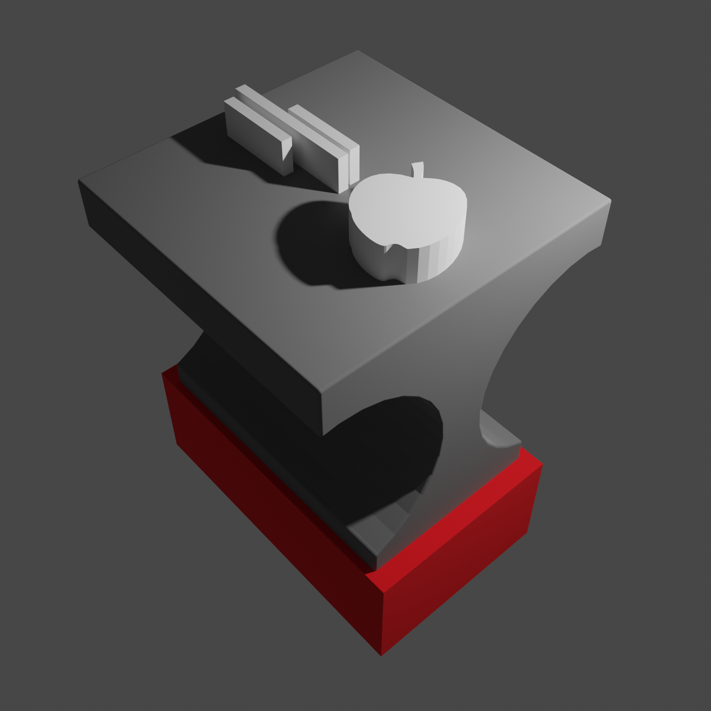

# Modelli 3D
Qui ci sono i modelli sviluppati dai membri dell'associazione, siano essi ideati da zero oppure modifiche di oggetti già esistenti.
## Strumenti
L'associazione ha formato i propri iscritti all'uso del software di modellazione Blender, gratuito e open source.

 
